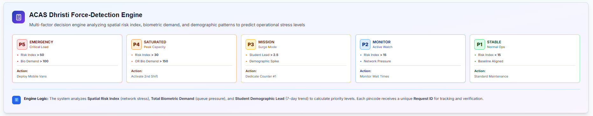
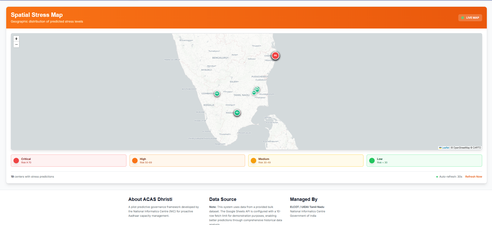
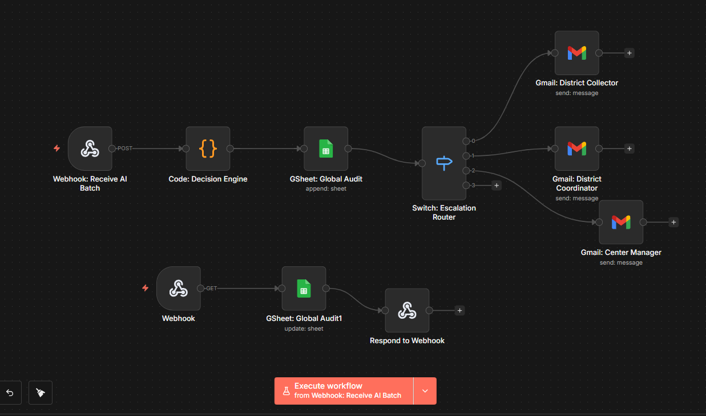

# ACAS Dhristi - Aadhaar Capacity Advisory System

## 🎯 Project Overview

**ACAS Dhristi** (Aadhaar Capacity Advisory System) is a **pilot predictive governance framework** developed for **Tamil Nadu** to proactively manage Aadhaar center capacity and prevent service disruptions before they occur.

### 🏆 Key Highlights
- **Proactive vs Reactive**: Predicts operational stress up to 7 days before citizen complaints arise.
- **Real-time Intelligence**: Live backend metadata stream powered by an autonomous n8n Agentic workflow.
- **Spatial Visualization**: Interactive map plotting 173,225+ Tamil Nadu center coordinates.
- **Multi-factor Engine**: Analyzes spatio-temporal risk index, biometric demand, and demographic patterns.
- **State-Agnostic**: Designed to scale nationally by recalculating regional baselines without architecture redesign.

---

## 📸 System Visualizations

### Predictive Governance Dashboard

### Live Spatial Stress Map (P1-P5 Risk Zones)

### Real-Time Intelligence & Audit Log

### Autonomous Agentic Workflow (n8n)

*View the raw workflow routing logic here: [ACAS n8n Workflow JSON](Automation/ACAS-n8n-Workflow.json)*

---

## 🚀 Features

### 1. **Spatial Stress Map**
- 🗺️ Interactive Leaflet.js map with OpenStreetMap tiles
- 🎨 Color-coded markers (Red/Orange/Amber/Green) based on predictive risk scores
- 📍 GeoJSON integration with precise Tamil Nadu center coordinates
- 💡 Interactive popups showing AI reasoning, priority, and recommended actions
- ⚡ Auto-refresh every 30 seconds

### 2. **Real-Time Intelligence Log**
- 📊 Full-width responsive tracking table featuring Pincode, AI Reasoning, and Request IDs
- 🎯 Priority-based color coding (P1-P5)
- ✅ Closed-loop verification status tracking for governance audits
- 🔄 Live backend stream integration

### 3. **Force-Detection Engine**
A multi-factor decision engine routing alerts based on 5 priority levels:
- **P5 - EMERGENCY**: Risk > 50, Bio Demand > 100 → Deploy Mobile Vans
- **P4 - SATURATED**: Risk > 30 OR Bio Demand > 150 → Activate 2nd Shift
- **P3 - MISSION**: Student Lead > 2.5 → Dedicate Counter #1
- **P2 - MONITOR**: Risk > 15 → Monitor Wait Times
- **P1 - STABLE**: Risk < 15 → Standard Maintenance

### 4. **Bilingual Support**
- 🌐 English and Tamil (தமிழ்) language toggle
- 🎨 Government-appropriate professional design
- 📱 Fully responsive (Desktop/Tablet/Mobile)

---

## 📊 Data Flow Architecture

<pre><code>
UIDAI Open APIs
      ↓
ML Core (Hybrid XGBoost + Spatio-Temporal Graph Neural Networks)
      ↓
n8n Automation Engine
      ↓
Google Sheets (Secure Audit Log)
      ↓
ACAS Dhristi Dashboard
</code></pre>

---

## 🔬 Technical Appendix: Decision Intelligence

**1. Spatio-Temporal Stress Index**
The framework moves beyond raw footfall by calculating a center-level stress metric:

$$Stress = \frac{Biometric Intensity + Student Lead}{Temporal Weight}$$

**2. Pattern Recognition Logic**
* **The Monday Weight:** Analysis of Tamil Nadu data reveals a consistent 40% surge at the start of the week; ACAS automatically applies a **1.4x temporal multiplier** to Monday predictions.
* **Student Lead Factor:** Flags mandatory biometric updates (MBU) during school admission windows, predicting surges 3-5 days before physical queues form.
* **Spatial Spillover (ST-GNN):** Captures network pressure where a high load in one district acts as a leading indicator for upcoming stress in neighboring interconnected nodes.

---

## 🛠️ Tech Stack

| Technology | Version | Purpose |
|------------|---------|---------|
| **Next.js** | 14.0.4 | React framework with SSR |
| **React** | 18.2.0 | UI library |
| **Tailwind CSS** | 3.4.0 | Utility-first CSS |
| **Framer Motion** | 10.16.16 | Animations |
| **Leaflet.js** | 1.9.4 | Interactive maps |
| **Axios** | 1.6.2 | HTTP client |
| **TypeScript** | 5.3.3 | Type safety |

---

## 📋 Prerequisites & Quick Start

### 1. Clone the Repository
<pre><code>
git clone https://github.com/Srevarshan05/UIDAI-Acas.git
cd UIDAI-Acas/acas-dashboard
</code></pre>

### 2. Install Dependencies & Run
<pre><code>
npm install
npm run dev
</code></pre>
The application will start on **http://localhost:3000**

---

## 🔧 Configuration

### Google Sheets API Setup
The system fetches real-time data from Google Sheets:  
**Sheet ID**: `1zmKUeplCU7AWkdqgfsKEhEUzjiqpGP0obepV0_iGyQ0`  
**Range**: `ACAS Dhristi LOG`

Create `.env.local` for custom configuration:
<pre><code>
NEXT_PUBLIC_SHEET_ID=your_sheet_id_here
NEXT_PUBLIC_API_KEY=your_api_key_here
</code></pre>

---

## 🎨 Color Scheme (GIGW 3.0 Standards)

| Color | Hex Code | Usage |
|-------|----------|-------|
| **Government Blue** | `#0D47A1` | Primary authority color |
| **Safety Orange** | `#EF6C00` | Urgent action highlights |
| **Background** | `#F8FAFC` | Off-white background |
| **Card White** | `#FFFFFF` | Card backgrounds |

---

## 🔒 Privacy & Compliance
- ✅ Uses **aggregated operational metadata only**
- ✅ **Zero contact** with CIDR central repositories
- ✅ **No private resident identity data** accessed
- ✅ Compliant with UIDAI data protection guidelines

---

## 📄 License & Team
This project is developed for the **UIDAI Tamil Nadu** pilot program.  
Managed by **ELCOT / UIDAI Tamil Nadu** and **National Informatics Centre (NIC)**.

* **Team ID**: UIDAI_7651
* **Team Lead**: Srevarshan Subramanian
* **Framework**: Predictive Governance Initiative

---

**Made with ❤️ for better governance in India** **ACAS Dhristi** - Predicting stress, preventing disruptions.
