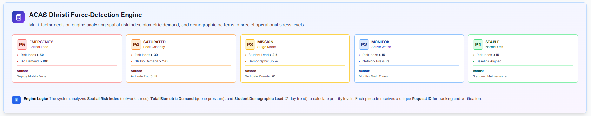
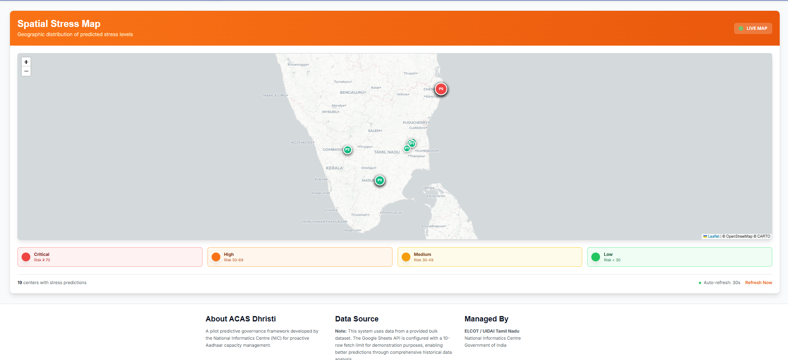
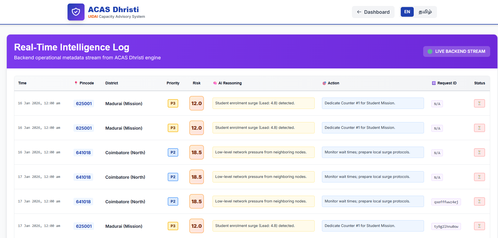
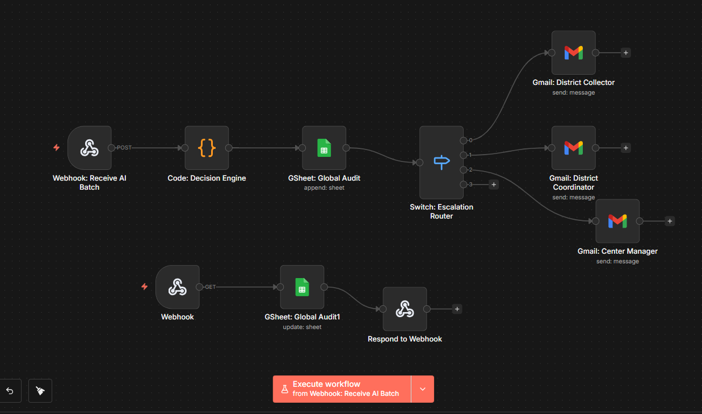

<div align="center">


<br/>

[](https://uidai.gov.in)
[](https://nextjs.org)
[](https://typescriptlang.org)
[](https://tailwindcss.com)
[](.)

<br/>

```
╔══════════════════════════════════════════════════════════════════════╗
║  TEAM ID: UIDAI_7651  ·  TEAM LEAD: Srevarshan Subramanian           ║
║  SCOPE: 173,225+ Tamil Nadu Aadhaar Centers  ·  Prediction: 7 Days  ║
╚══════════════════════════════════════════════════════════════════════╝
```

</div>

---

## The Problem I Solved

> Aadhaar enrollment centers across Tamil Nadu operate **reactively** — staff are deployed only after queues form, complaints spike, or biometric failures occur. By then, citizens have already waited for hours.

**ACAS Dhristi flips this model.** It predicts operational stress **up to 7 days before it happens** — before the queue, before the complaint, before the disruption.

This is not a dashboard. It is a **predictive governance framework** that converts raw operational metadata into prioritised, actionable alerts — spatially mapped across every district in Tamil Nadu.

---

## What I Built

```
┌──────────────────────────────────────────────────────────────────────────┐
│                     ACAS DHRISTI — SYSTEM OVERVIEW                       │
│                                                                          │
│  ┌─────────────┐    ┌──────────────┐    ┌─────────────────────────────┐  │
│  │ UIDAI Open  │───►│  ML Core     │───►│  n8n Agentic Workflow       │  │
│  │    APIs     │    │  XGBoost +   │    │  Autonomous alert routing   │  │
│  └─────────────┘    │  ST-GNN      │    └────────────┬────────────────┘  │
│                     └──────────────┘                 │                   │
│                                                      ▼                   │
│  ┌─────────────────────────────────────────────────────────────────────┐ │
│  │                    ACAS Dhristi Dashboard                           │ │
│  │                                                                     │ │
│  │  ┌────────────────┐  ┌─────────────────┐  ┌──────────────────────┐ │ │
│  │  │  Spatial Stress │  │  Real-Time Intel │  │  Force-Detection     │ │ │
│  │  │  Map            │  │  Audit Log       │  │  Engine (P1–P5)      │ │ │
│  │  │  173,225 nodes  │  │  Live stream     │  │  5-tier priority     │ │ │
│  │  └────────────────┘  └─────────────────┘  └──────────────────────┘ │ │
│  └─────────────────────────────────────────────────────────────────────┘ │
│                                                      │                   │
│                                                      ▼                   │
│                              ┌───────────────────────────────┐           │
│                              │  Google Sheets Audit Log      │           │
│                              │  Closed-loop governance trail │           │
│                              └───────────────────────────────┘           │
└──────────────────────────────────────────────────────────────────────────┘
```

---

## System Visualizations

<table>
<tr>
<td width="50%">

**Predictive Governance Dashboard**


</td>
<td width="50%">

**Live Spatial Stress Map — P1 to P5 Risk Zones**


</td>
</tr>
<tr>
<td width="50%">

**Real-Time Intelligence & Audit Log**


</td>
<td width="50%">

**Autonomous n8n Agentic Workflow**


</td>
</tr>
</table>

> 📎 Raw n8n workflow routing logic: [ACAS-n8n-Workflow.json](Automation/ACAS-n8n-Workflow.json)

---

## Decision Intelligence — How the Prediction Works

### Spatio-Temporal Stress Index

The core metric moves beyond raw footfall by combining three signals:

```
                   Biometric Intensity  +  Student Lead Factor
  Stress Index  =  ─────────────────────────────────────────────
                              Temporal Weight
```

### Three-Signal Pattern Engine

```
┌───────────────────────────────────────────────────────────────┐
│  SIGNAL 1 — The Monday Effect                                 │
│  Tamil Nadu data reveals a consistent 40% surge at week-start │
│  → ACAS applies a 1.4× temporal multiplier to all Mondays     │
├───────────────────────────────────────────────────────────────┤
│  SIGNAL 2 — Student Lead Factor                               │
│  Detects mandatory biometric update (MBU) windows during      │
│  school admissions → predicts surges 3–5 days before queues   │
├───────────────────────────────────────────────────────────────┤
│  SIGNAL 3 — Spatial Spillover (ST-GNN)                        │
│  High load in one district acts as a leading indicator for     │
│  neighboring nodes → captures network pressure propagation    │
└───────────────────────────────────────────────────────────────┘
```

### Force-Detection Priority Engine

| Priority | Condition | Automated Response |
|---|---|---|
| 🔴 **P5 — EMERGENCY** | Risk > 50 AND Biometric Demand > 100 | Deploy Mobile Vans |
| 🟠 **P4 — SATURATED** | Risk > 30 OR Biometric Demand > 150 | Activate 2nd Shift |
| 🟡 **P3 — MISSION** | Student Lead > 2.5 | Dedicate Counter #1 |
| 🔵 **P2 — MONITOR** | Risk > 15 | Monitor Wait Times |
| 🟢 **P1 — STABLE** | Risk < 15 | Standard Maintenance |

---

## Key Features

**Spatial Stress Map**
Real-time Leaflet.js map with 173,225+ Tamil Nadu center coordinates. Color-coded P1–P5 risk markers with AI reasoning, priority level, and recommended action in each popup. Auto-refreshes every 30 seconds.

**Real-Time Intelligence Log**
Full-width audit table with Pincode, AI reasoning, Request IDs, and closed-loop verification status — built for governance audits, not just monitoring.

**Bilingual Interface**
English / Tamil (தமிழ்) language toggle. Built to GIGW 3.0 government standards with appropriate authority-grade visual design.

**Autonomous Agentic Workflow**
n8n workflow handles backend metadata ingestion, alert routing, and Google Sheets audit logging — fully autonomous, zero manual intervention.

---

## Tech Stack

```
sre@acas-dhristi:~$ cat tech_stack.json
```

```json
{
  "frontend": {
    "Next.js":      "14.0.4  — React framework with SSR",
    "React":        "18.2.0  — UI component library",
    "TypeScript":   "5.3.3   — Type-safe development",
    "Tailwind CSS": "3.4.0   — Utility-first styling",
    "Framer Motion":"10.16.16— Animations",
    "Leaflet.js":   "1.9.4   — Interactive spatial maps",
    "Axios":        "1.6.2   — HTTP client"
  },
  "backend_automation": {
    "n8n":           "Agentic workflow engine — alert routing & ingestion",
    "Google Sheets": "Secure audit log & closed-loop verification"
  },
  "ml_core": {
    "XGBoost":  "Primary prediction model",
    "ST-GNN":   "Spatial spillover detection (Spatio-Temporal Graph Neural Network)"
  }
}
```

---

## Quickstart

### 1. Clone & Install

```bash
git clone https://github.com/Srevarshan05/UIDAI-Acas.git
cd UIDAI-Acas/acas-dashboard
npm install
npm run dev
# → http://localhost:3000
```

### 2. Configure Environment

```bash
cp .env.example .env.local
```

```env
NEXT_PUBLIC_SHEET_ID=your_google_sheet_id
NEXT_PUBLIC_API_KEY=your_api_key
```

**Google Sheets setup:**
- Sheet ID: `1zmKUeplCU7AWkdqgfsKEhEUzjiqpGP0obepV0_iGyQ0`
- Range: `ACAS Dhristi LOG`
- Enable Google Sheets API and generate a service account key

---

## Scalability

```
sre@acas-dhristi:~$ cat scalability.txt
```

```
State-Agnostic Architecture
─────────────────────────────────────────────────────────────────
ACAS Dhristi is designed for national rollout.

Scaling to a new state requires only:
  1. Ingesting that state's center coordinates (GeoJSON)
  2. Recalibrating regional stress baselines
  3. Retraining the temporal weight multipliers

No architecture redesign. No new infrastructure.
The same prediction engine generalises across any state.

Current scope:  Tamil Nadu  →  173,225 centers
Target scope:   All India   →  ~1.4M+ enrollment points
```

---

## Privacy & Compliance

```
[✓]  Aggregated operational metadata only — zero individual data
[✓]  No contact with CIDR central repositories
[✓]  No private resident identity data accessed or stored
[✓]  Compliant with UIDAI data protection guidelines
[✓]  Audit trail maintained via closed-loop Google Sheets log
[✓]  GIGW 3.0 compliant UI design standards
```

---

## Project Info

```
Team ID      :  UIDAI_7651
Team Lead    :  Srevarshan Subramanian
Scope        :  Tamil Nadu Pilot — UIDAI Predictive Governance Initiative
Partners     :  ELCOT / UIDAI Tamil Nadu · National Informatics Centre (NIC)
Prediction   :  Up to 7 days ahead of citizen complaints
Coverage     :  173,225+ Aadhaar center coordinates
```

---

<div align="center">


*Predicting stress. Preventing disruption. Built for India.*

**[Sre Varshan](https://github.com/Srevarshan05)** · AI/ML Engineer · SRM Trichy · 2027

</div>
